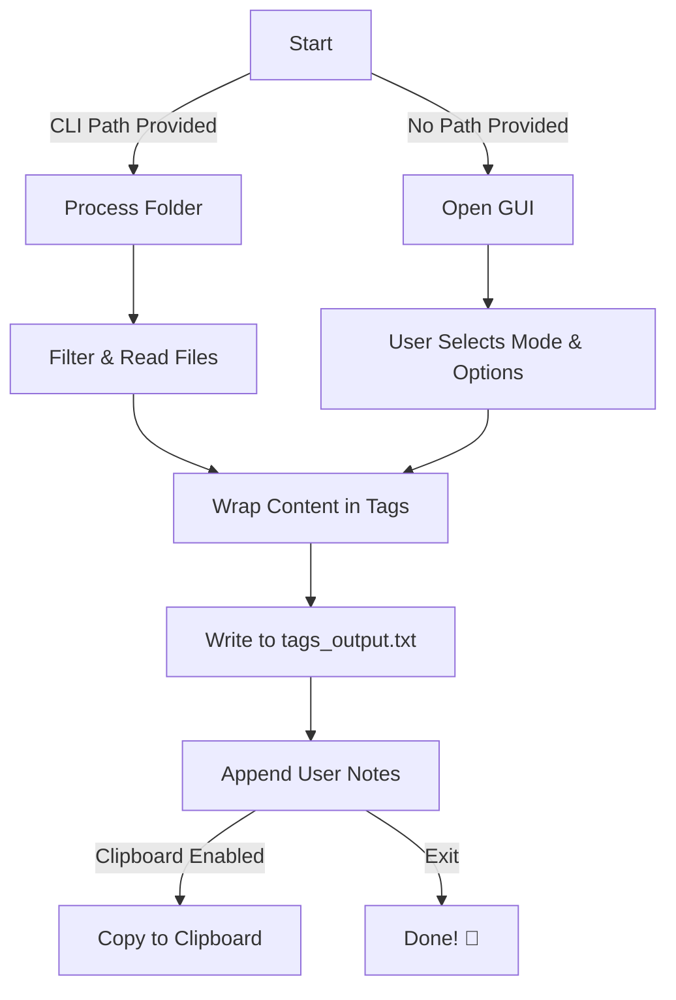

Here is the updated **README** with the `clipboard-win` change reflected:

---

# 🗂️ **Code File Wrapper**  

<p align="center">
  <b>Wrap your code files inside XML-style tags effortlessly! 🚀</b> <br>
  <i>Supports multiple languages, GUI mode, clipboard integration, and more!</i>
</p>

<p align="center">
  
  
  
  
</p>

---

## 📌 Version  
- **Latest Release:** `0.2.0`
- **Author:** `Multiplex55`

---

## ✨ Features  
✅ **Wraps files inside XML-like tags**  
✅ **Supports multiple languages** (`.rs`, `.json`, `.xml`, `.c`, `.cpp`, `.ahk`, etc.)  
✅ **GUI Mode & CLI Mode** 🎨📜  
✅ **Clipboard Integration** 📋  
✅ **Multi-line Notes Section** 📝  
✅ **Error Handling & Debugging Messages** ⚠️  
✅ **Lightweight & Blazing Fast** ⚡  
✅ **Useful for providing context to AIs or documentation** 🤖  

---

## 📥 Installation  

### **Prerequisites:**  
- 🦀 [Rust Installed](https://www.rust-lang.org/tools/install)  

### **Build From Source:**  

```sh
git clone https://github.com/your-username/code-file-wrapper.git
cd code-file-wrapper
cargo build --release
```

---

## 📦 Dependencies  
| Name             | Version | Description                                | Link |
|----------------|---------|--------------------------------|------|
| `clap`        | `4.5.23` | Command-line argument parsing | [📦 Crates.io](https://crates.io/crates/clap) |
| `clipboard-win` | `4.4.1` | Windows clipboard integration | [📦 Crates.io](https://crates.io/crates/clipboard-win) |
| `eframe`      | `0.30.0` | GUI framework for Rust | [📦 Crates.io](https://crates.io/crates/eframe) |
| `rfd`         | `0.15.2` | File dialog UI helper | [📦 Crates.io](https://crates.io/crates/rfd) |
| `windows`     | `0.59.0` | Windows API bindings | [📦 Crates.io](https://crates.io/crates/windows) |
| `winit`       | `0.30.8` | Window handling library | [📦 Crates.io](https://crates.io/crates/winit) |

---

## 🚀 Usage  

### **CLI Mode**  
Run the program with a folder path:

```sh
./code-file-wrapper /path/to/directory
```

### **GUI Mode**  
To launch the interactive GUI mode:

```sh
./code-file-wrapper
```

**GUI Features:**  
✔️ **Select a processing mode**  
✔️ **Enable automatic clipboard saving**  
✔️ **Provide additional multi-line notes**  

---

## 📜 How It Works  

### **Flowchart of Execution**  


---

## ➡️ Output Example  
**Generated `tags_output.txt` file:**  
```
<main.rs>
fn main() {
    println!("Hello, world!");
}
</main.rs>

[Additional Commands]
TODO: Add feature X...
```

---

## 🤝 Contributing  

🎉 **We welcome contributions!** 🎉  

To contribute:  
1. **Fork** the repository  
2. Create a **feature branch**  
3. **Submit a pull request**  

---

## ⚖️ License  

📜 **MIT License** - Feel free to modify and distribute!  

---

## 🌟 Show Some Love!  

If you like this project, **drop a ⭐ on GitHub!** 🚀  

