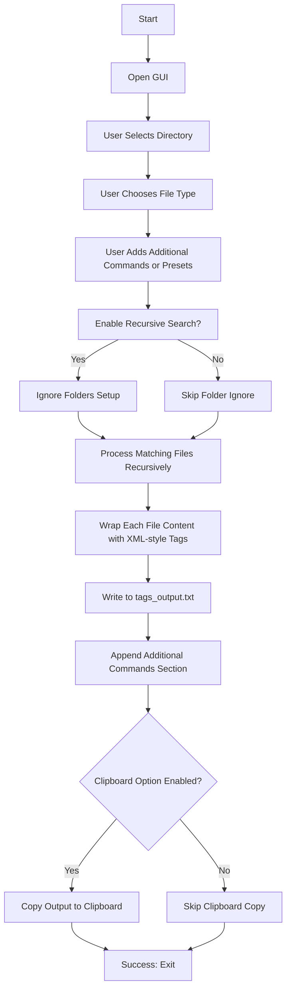

# 🗂️ **Code File Wrapper**

<p align="center">
  <b>Wrap your code files inside XML-style tags effortlessly! 🚀</b> <br>
  <i>Includes GUI mode, clipboard support, recursion, preset commands, and more!</i>
</p>

<p align="center">
  
  
  
  
</p>

---

## 📌 Version  
- **Latest Release:** `1.0.0`  
- **Author:** `Multiplex55`  
- **License:** MIT  
- **Platform:** 🖥 Windows Only 
# 🗂️ **Code File Wrapper**  

<p align="center">
  <b>Wrap your code files inside XML-style tags effortlessly! 🚀</b> <br>
  <i>Supports multiple languages, GUI mode, clipboard integration, folder ignoring, and more!</i>
</p>

<p align="center">
  
  
  
  
</p>

---

## 📌 Version  
- **Latest Release:** `0.1.0`
- **Author:** `Multiplex55`
- **License:** MIT  
- **Platform:** 🖥 Windows Only  

---

## ✨ Features  
✅ **Wraps code files inside XML-like tags**  
✅ **Supports multiple file types** (`.rs`, `.json`, `.xml`, `.c`, `.cpp`, `.h`, `.lua`, `.ahk`)  
✅ **Modern Graphical User Interface (GUI)** 🎨  
✅ **Automatic Clipboard Copy Option** 📋  
✅ **Recursive Directory Search** 🔍  
✅ **Folder Ignoring Rules** 📂 (skip `target/`, `.git/`, etc.)  
✅ **Multi-line Additional Commands Section** 📝  
✅ **Preset Command Templates** ⚙️  
✅ **Error Handling and Warnings** ⚠️  
✅ **Fast and Lightweight** ⚡  
✅ **Optimized for AI Code Context or Documentation Workflows** 🤖  

---

## 📥 Installation  

### **Prerequisites:**  
- 🦀 [Rust Installed](https://www.rust-lang.org/tools/install)  

### **Build From Source:**  
```sh
git clone https://github.com/multiplex55/code-file-wrapper.git
cd code-file-wrapper
cargo build --release
```

---

## 📦 Dependencies  

| Name             | Version | Description                                  | Link |
|------------------|---------|----------------------------------------------|------|
| `eframe`         | `0.30.0` | GUI framework for building native apps      | [📦 Crates.io](https://crates.io/crates/eframe) |
| `rfd`            | `0.15.2` | Native file/folder dialog library           | [📦 Crates.io](https://crates.io/crates/rfd) |
| `clipboard-win`  | `4.4.1`  | Windows clipboard API binding               | [📦 Crates.io](https://crates.io/crates/clipboard-win) |
| `windows`        | `0.59.0` | Win32 API bindings for Rust                 | [📦 Crates.io](https://crates.io/crates/windows) |
| `winit`          | `0.30.8` | Window creation and event handling library | [📦 Crates.io](https://crates.io/crates/winit) |

---

## 🚀 Usage  

### **Launching the GUI Mode**  
After building, simply run the executable:

```sh
./code-file-wrapper
```

**Main GUI Options:**  
✔️ Select processing file mode (Rust, JSON, etc.)  
✔️ Choose a target directory  
✔️ Enable recursive search  
✔️ Ignore unwanted folders (optional)  
✔️ Add custom multi-line additional commands  
✔️ Select preset templates  
✔️ Copy output to clipboard automatically

---

## 📜 How It Works  

### **Updated Execution Flowchart**  


---

## ➡️ Output Example  

**Generated `tags_output.txt`:**
```xml
<main.rs>
fn main() {
    println!("Hello, world!");
}
</main.rs>

[Additional Commands]
TODO: Add refactoring checklist...
```

---

## 📊 Example Use Cases  

### 📝 **AI Context Provider**
- Perfect for giving ChatGPT, Claude, or other AIs a "full project view" in a single prompt.
- Wraps your files cleanly so AI models can understand structure better.

### 📚 **Automated Documentation Extraction**
- Capture important source files into portable text blobs.
- Pipe into documentation generators, git history comments, etc.

### 📋 **Clipboard Efficiency**
- Instantly copy processed output into GitHub issues, bug reports, or tech support emails.

---

## 🤝 Contributing  

🎉 **Contributions are welcome!** 🎉  

- Fork the repo  
- Create your own branch  
- Make your changes  
- Submit a pull request 🚀

---

## ⚖️ License  

📜 **MIT License**  
- Free to use, modify, and distribute!  

---

## 🌟 Show Some Love!  

If you found this project helpful, **drop a ⭐ on GitHub!**  

---
 Recursive folder traversal (optional)  
✅ Folder exclusion rules (e.g., `.git`, `target`)  
✅ Additional command section + preset text insertion  
✅ Clipboard copy support (UTF-16 Windows clipboard)  
✅ Preset manager to create/edit reusable instruction blocks  
✅ Uses `eframe` + `egui` for fast native GUI  
✅ Optimized for AI prompt pipelines and full-project context packing  

---

## 📥 Installation

### Prerequisites  
- 🦀 [Rust](https://www.rust-lang.org/tools/install) installed

### Build From Source  
```sh
git clone https://github.com/multiplex55/code-file-wrapper.git
cd code-file-wrapper
cargo build --release
```

---

## 📦 Dependencies

| Crate           | Purpose                                      |
|----------------|----------------------------------------------|
| `eframe`        | Native GUI framework                        |
| `rfd`           | Native file/folder picker                   |
| `clipboard-win` | Clipboard access (Windows-only)             |
| `windows`       | Win32 bindings (`GetCursorPos`, etc.)       |
| `winit`         | GUI integration, window event loop          |
| `serde`         | JSON serialization for preset storage       |

---

## 🚀 Usage

### Launch GUI  
```sh
./target/release/code-file-wrapper
```

### GUI Actions  
- Select directory containing source files  
- Choose filetype mode (Rust, JSON, AHK, etc.)  
- Enable recursion and ignore folders if needed  
- Add manual instructions or select a preset  
- Output is written to `tags_output.txt`  
- Optionally copies output to your clipboard  

---

## 📜 How It Works


---

## 📄 Output Example

```xml
<src/lib.rs>
pub fn greet() {
    println!("Hello!");
}
</src/lib.rs>

[Additional Commands]
TODO: Review error handling in all entry points.
```

---

## 📚 Use Cases

### 🧠 AI Prompt Construction  
Bundle multiple files into one tagged blob, ready to feed into ChatGPT, Claude, etc.

### 📎 Support / Bug Reports  
Instantly paste full project context into GitHub issues or support threads.

### 🛠️ Offline Processing  
Prepare files for static analysis, formatting, or documentation via downstream tools.

---

## 🔧 Preset System

Define common instruction blocks once and reuse them via dropdown.  
Includes examples like:

- "Create Function Documentation"  
- "Create Readme"  
- Custom slots (`Button 3–5`) for expansion

Presets are stored in `presets.json` and can be fully managed via the GUI.

---

## 🤝 Contributing

🎉 All contributions are welcome!  

1. Fork this repo  
2. Create a new branch  
3. Commit your changes  
4. Submit a pull request 🚀

---

## ⚖️ License

MIT License — free to use, modify, and distribute.  

---

## 🌟 Like the Project?

If this saved you time or helped your workflow,  
**please star the repo!** ⭐
