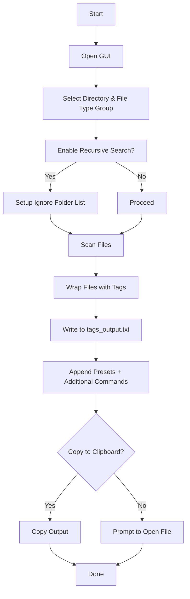

# 🗂️ **Code File Wrapper**

<p align="center">
  <b>Wrap your code files inside XML-style tags effortlessly! 🚀</b> <br>
  <i>Includes GUI mode, clipboard support, recursion, preset commands, and more!</i>
</p>

<p align="center">
  
  
  
  
</p>

---

## 📌 Version  
- **Latest Release:** `1.1.0`  
- **Author:** `Multiplex55`  
- **License:** MIT  
- **Platform:** 🖥 Windows Only  

---

## ✨ Features  

✅ Wraps code files in clean XML-style tags based on relative paths  
✅ File extension filtering (`.rs`, `.json`, `.lua`, `.ahk`, etc.)  
✅ 🔧 GUI-based File Type Group Manager (create/edit/delete extension sets)  
✅ Modern GUI with native folder picker and filetype selector  
✅ Recursive folder traversal (optional)  
✅ Folder exclusion rules (e.g., `.git`, `target`)  
✅ Additional command section + preset text insertion  
✅ Clipboard copy support (UTF-16 Windows clipboard)  
✅ Preset manager to create/edit reusable instruction blocks  
✅ Uses `eframe` + `egui` for fast native GUI  
✅ Optimized for AI prompt pipelines and full-project context packing  

---

## 📥 Installation

### Prerequisites  
- 🦀 [Rust](https://www.rust-lang.org/tools/install) installed

### Build From Source  
```sh
git clone https://github.com/multiplex55/code-file-wrapper.git
cd code-file-wrapper
cargo build --release
```

---

## 📦 Dependencies

| Crate           | Purpose                                      |
|----------------|----------------------------------------------|
| `eframe`        | Native GUI framework                        |
| `rfd`           | Native file/folder picker                   |
| `clipboard-win` | Clipboard access (Windows-only)             |
| `windows`       | Win32 bindings (`GetCursorPos`, etc.)       |
| `serde`         | JSON serialization for preset + filetypes   |

---

## 🚀 Usage

### Launch GUI  
```sh
./target/release/code-file-wrapper
```

### GUI Actions  
- Select directory containing source files  
- Choose or manage filetype groups (Rust, JSON, Web, etc.)  
- Enable recursion and ignore folders if needed  
- Add manual instructions or select a preset  
- Output is written to `tags_output.txt`  
- Optionally copies output to your clipboard  

---

## 📜 How It Works



---

## 📄 Output Example

```xml
<src/lib.rs>
pub fn greet() {
    println!("Hello!");
}
</src/lib.rs>

[Additional Commands]
TODO: Review error handling in all entry points.
```

---

## 📚 Use Cases

### 🧠 AI Prompt Construction  
Bundle multiple files into one tagged blob, ready to feed into ChatGPT, Claude, etc.

### 📎 Support / Bug Reports  
Instantly paste full project context into GitHub issues or support threads.

### 🛠️ Offline Processing  
Prepare files for static analysis, formatting, or documentation via downstream tools.

---

## 🔧 Preset System

Define common instruction blocks once and reuse them via dropdown.  
Includes examples like:

- "Create Function Documentation"  
- "Create Readme"  
- Custom slots (`Button 3–5`) for expansion

Presets are stored in `presets.json` and can be fully managed via the GUI.

---

## 🧩 File Type Groups

Manage which file extensions to include via editable file groups.  
Stored in `filetypes.json`, managed in GUI under **Manage File Types**.

Examples:
- **Rust** → `["rs"]`  
- **Web** → `["html", "css", "js"]`  
- **JSON & Config** → `["json", "ron", "toml"]`

---

## 🤝 Contributing

🎉 All contributions are welcome!  

1. Fork this repo  
2. Create a new branch  
3. Commit your changes  
4. Submit a pull request 🚀

---

## ⚖️ License

MIT License — free to use, modify, and distribute.  

---

## 🌟 Like the Project?

If this saved you time or helped your workflow,  
**please star the repo!** ⭐
