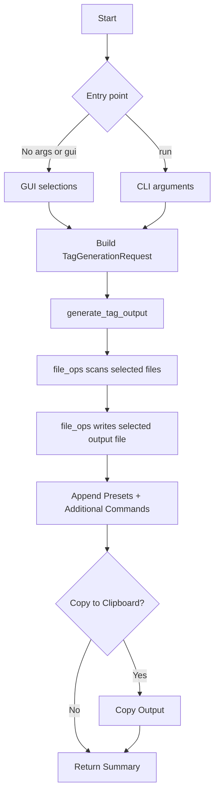

# 🗂️ **Code File Wrapper**

<p align="center">
  <b>Wrap your code files inside XML-style tags effortlessly! 🚀</b> <br>
  <i>Includes GUI mode, clipboard support, recursion, preset commands, and more!</i>
</p>

<p align="center">
  
  
  
  
</p>

---

## 📌 Version  
- **Latest Release:** `1.1.0`  
- **Author:** `Multiplex55`  
- **License:** MIT  
- **Platform:** 🖥 Windows and Linux

---

## ✨ Features  

✅ Wraps code files in clean XML-style tags based on relative paths  
✅ File extension filtering (`.rs`, `.json`, `.lua`, `.ahk`, etc.)  
✅ 🔧 GUI-based File Type Group Manager (create/edit/delete extension sets)  
✅ Modern GUI with native folder picker and filetype selector  
✅ Recursive folder traversal (optional)  
✅ Folder exclusion rules (e.g., `.git`, `target`)  
✅ Additional command section + preset text insertion  
✅ Clipboard copy support (UTF-16 Windows clipboard)  
✅ Preset manager to create/edit reusable instruction blocks  
✅ Uses `eframe` + `egui` for fast native GUI  
✅ Optimized for AI prompt pipelines and full-project context packing  

---

## 📥 Installation

### Prerequisites  
- 🦀 [Rust](https://www.rust-lang.org/tools/install) installed

### Build From Source  
```sh
git clone https://github.com/multiplex55/code-file-wrapper.git
cd code-file-wrapper
cargo build --release
```

---

## 📦 Dependencies

| Crate           | Purpose                                      |
|----------------|----------------------------------------------|
| `eframe`        | Native GUI framework                        |
| `rfd`           | Native file/folder picker                   |
| `clipboard-win` | Clipboard access (Windows-only)             |
| `windows`       | Win32 bindings (`GetCursorPos`, etc.)       |
| `serde`         | JSON serialization for preset + filetypes   |

---

## 🚀 Usage

### Launch GUI  
Running the binary without arguments launches the GUI.

```sh
./target/release/code-file-wrapper
```

You can also launch the GUI explicitly from an installed binary:

```sh
code-file-wrapper gui
```

### GUI Actions  
- Select directory containing source files  
- Choose or manage filetype groups (Rust, JSON, Web, etc.)  
- Enable recursion and ignore folders if needed  
- Add manual instructions or select a preset  
- The output field defaults to `tags_output.txt`; edit it to write to any non-directory output path
- Optionally copies output to your clipboard  

### CLI Examples

The CLI uses the same shared generation engine as the GUI, so tagged output, recursive traversal, ignored folders, additional commands, presets, output-path handling, and clipboard copy behavior are generated consistently whether you run interactively or from a script.

Run without a subcommand to launch the GUI:

```sh
code-file-wrapper
```

Launch the GUI explicitly:

```sh
code-file-wrapper gui
```

List configured file type groups from `filetypes.json`:

```sh
code-file-wrapper list-file-types
```

Generate Rust context from the current directory recursively. Without `--output`, the CLI writes to `tags_output.txt` in the current working directory:

```sh
code-file-wrapper run --dir . --file-type Rust --recursive
```

Use `--output <path>` to override the CLI default output path for repeatable no-GUI workflows:

```sh
code-file-wrapper run --dir . --file-type Rust --recursive --output rust_context.txt
```

Select individual extensions instead of a file type group. Repeat `--ext` once per extension:

```sh
code-file-wrapper run --dir . --ext rs --ext toml --ext md --recursive
```

Copy the generated output to the clipboard after writing the output file:

```sh
code-file-wrapper run --dir . --file-type Rust --recursive --copy
```

### Default Output Behavior

- No arguments launches the GUI: `code-file-wrapper`.
- The GUI output field starts as `tags_output.txt`, and you can replace it with a custom file path before clicking **OK**.
- The CLI `run` subcommand defaults `--output` to `tags_output.txt`.
- Both GUI and CLI reject an output path that already points to a directory; use a filename instead.

### CLI Error Behavior

The CLI validates arguments before or during generation and exits non-zero on errors. Common cases are:

- **Unknown file type group:** `--file-type <name>` must match a group from `filetypes.json`; run `code-file-wrapper list-file-types` to see valid names.
- **Missing extension selection:** `code-file-wrapper run --dir .` is invalid because `run` needs either `--file-type <group>` or at least one `--ext <extension>`.
- **Invalid directory:** `--dir <path>` must exist and be a directory.
- **Output path is a directory:** `--output <path>` must name a file path, not an existing folder.

Profiles are optional convenience helpers for saving command arguments, but they are not required for repeatability. A checked-in shell, PowerShell, or batch script that calls `code-file-wrapper run` with explicit arguments is fully repeatable without using profiles.

#### PowerShell Script Template

```powershell
$CodeFileWrapper = "C:\Tools\code-file-wrapper\code-file-wrapper.exe"
$ProjectPath = "C:\Projects\my-rust-app"
$OutputPath = Join-Path $ProjectPath "rust_context.txt"
$CopyToClipboard = $false  # Set to $true to also copy output after writing the file.

$Arguments = @(
    "run",
    "--dir", $ProjectPath,
    "--file-type", "Rust",
    "--recursive",
    "--ignore", "target",
    "--ignore", ".git",
    "--output", $OutputPath
)

if ($CopyToClipboard) {
    $Arguments += "--copy"
}

& $CodeFileWrapper @Arguments
if ($LASTEXITCODE -ne 0) {
    exit $LASTEXITCODE
}
```

#### Windows Batch Script Template

```bat
@echo off
set "CODE_FILE_WRAPPER=C:\Tools\code-file-wrapper\code-file-wrapper.exe"
set "PROJECT_PATH=C:\Projects\my-rust-app"
set "OUTPUT_PATH=%PROJECT_PATH%\rust_context.txt"
set "COPY_TO_CLIPBOARD=0"

set "COPY_ARG="
if "%COPY_TO_CLIPBOARD%"=="1" set "COPY_ARG=--copy"

"%CODE_FILE_WRAPPER%" run ^
  --dir "%PROJECT_PATH%" ^
  --file-type Rust ^
  --recursive ^
  --ignore target ^
  --ignore .git ^
  --output "%OUTPUT_PATH%" ^
  %COPY_ARG%

if errorlevel 1 exit /b %errorlevel%
```

### Windows CLI and GUI Tradeoff

The Windows build uses the normal console subsystem so CLI output and errors are visible in PowerShell. This means commands such as `code-file-wrapper list-file-types` print their results normally, and invalid CLI invocations show errors with non-zero exit codes.

The tradeoff is that launching the GUI build directly on Windows may show a console window alongside the graphical interface. A future two-binary design could provide `code-file-wrapper.exe` for CLI use and `code-file-wrapper-gui.exe` with `windows_subsystem = "windows"` for GUI-only launch without a console window.

---

## 📜 How It Works

### Architecture

The application has one shared generation path for both interactive and scripted use:

- The GUI gathers selections, then `main.rs` builds a `TagGenerationRequest`.
- The CLI parses `code-file-wrapper run ...`, then `cli.rs` builds a `TagGenerationRequest`.
- Both flows call `generate_tag_output` in `src/generation.rs`.
- `src/file_ops.rs` only scans directories and writes/appends files; it does not parse CLI arguments, run GUI dialogs, or own output-path defaults.


```mermaid
graph TD;
    A[Start] --> B{Entry point}
    B -->|No args or gui| C[GUI selections]
    B -->|run| D[CLI arguments]
    C --> E[Build TagGenerationRequest]
    D --> E
    E --> F[generate_tag_output]
    F --> G[file_ops scans selected files]
    G --> H[file_ops writes selected output file]
    H --> I[Append Presets + Additional Commands]
    I --> J{Copy to Clipboard?}
    J -->|Yes| K[Copy Output]
    J -->|No| L[Return Summary]
    K --> L
```

---

## 📄 Output Example

```xml
<src/lib.rs>
pub fn greet() {
    println!("Hello!");
}
</src/lib.rs>

[Additional Commands]
TODO: Review error handling in all entry points.
```

---

## 📚 Use Cases

### 🧠 AI Prompt Construction  
Bundle multiple files into one tagged blob, ready to feed into ChatGPT, Claude, etc.

### 📎 Support / Bug Reports  
Instantly paste full project context into GitHub issues or support threads.

### 🛠️ Offline Processing  
Prepare files for static analysis, formatting, or documentation via downstream tools.

---

## 🔧 Preset System

Define common instruction blocks once and reuse them via dropdown.  
Includes examples like:

- "Create Function Documentation"  
- "Create Readme"  
- Custom slots (`Button 3–5`) for expansion

Presets are stored in `presets.json` and can be fully managed via the GUI.

---

## 🧩 File Type Groups

Manage which file extensions to include via editable file groups.  
Stored in `filetypes.json`, managed in GUI under **Manage File Types**.

Examples:
- **Rust** → `["rs"]`  
- **Web** → `["html", "css", "js"]`  
- **JSON & Config** → `["json", "ron", "toml"]`

---

## 🤝 Contributing

🎉 All contributions are welcome!  

1. Fork this repo  
2. Create a new branch  
3. Commit your changes  
4. Submit a pull request 🚀

---

## ⚖️ License

MIT License — free to use, modify, and distribute.  

---

## 🌟 Like the Project?

If this saved you time or helped your workflow,  
**please star the repo!** ⭐
