<h1 align="center">Code File Wrapper</h1>

<p align="center">
  <b>Wrap your code files inside XML-style tags effortlessly! 🚀</b> <br>
  <i>Supports multiple languages, GUI mode, clipboard integration, and more!</i>
</p>

<p align="center">
  
  
  
  
</p>

---

## ✨ Features
✅ **Wraps files inside XML-like tags**  
✅ **Supports multiple languages** (`.rs`, `.json`, `.xml`, `.c`, `.cpp`, `.ahk`, etc.)  
✅ **GUI Mode & CLI Mode** 🎨📜  
✅ **Clipboard Integration** 📋  
✅ **Multi-line Notes Section** 📝 
✅ **Error Handling & Debugging Messages** ⚠️  
✅ **Lightweight & Blazing Fast** ⚡  
✅ **Useful for providing context to AIs or documentation** 🤖

---

## 📥 Installation

**Prerequisites:**  
- 🦀 [Rust Installed](https://www.rust-lang.org/tools/install)  

Clone the repo and build:  

```sh
git clone https://github.com/your-username/code-file-wrapper.git
cd code-file-wrapper
cargo build --release
```

---

## 🚀 Usage  

### **CLI Mode**  

To run **CLI mode**, provide a folder path:  

```sh
./code-file-wrapper /path/to/directory
```

### **GUI Mode**  
To launch the interactive **GUI mode**, just run:

```sh
./code-file-wrapper
```

**GUI Features:**  
✔️ **Select a processing mode**  
✔️ **Enable automatic clipboard saving**  
✔️ **Provide additional multi-line notes**  

---

## 📜 How It Works  

### **Flowchart of Execution**  

```mermaid
graph TD;
    A[Start] -->|CLI Path Provided| B[Process Folder]
    A -->|No Path Provided| C[Open GUI]
    B --> D[Filter & Read Files]
    C --> E[User Selects Mode & Options]
    D --> F[Wrap Content in Tags]
    E --> F
    F --> G[Write to tags_output.txt]
    G --> H[Append User Notes]
    H -->|Clipboard Enabled| I[Copy to Clipboard]
    H -->|Exit| J[Done! 🎉]
```


---
## ➡️ Output
**Final Output Example (`tags_output.txt`):**  
```
<main.rs>
fn main() {
    println!("Hello, world!");
}
</main.rs>

[Additional Commands]
TODO: Add feature X...
```

---

## 🤝 Contributing  

🎉 **We welcome contributions!** 🎉 

To contribute:  
1. **Fork** the repository  
2. Create a **feature branch**  
3. **Submit a pull request**  

---

## ⚖️ License  

📜 **MIT License** - Feel free to modify and distribute!  

---

## 🌟 Show Some Love!  

If you like this project, **drop a ⭐ on GitHub!**  
```
